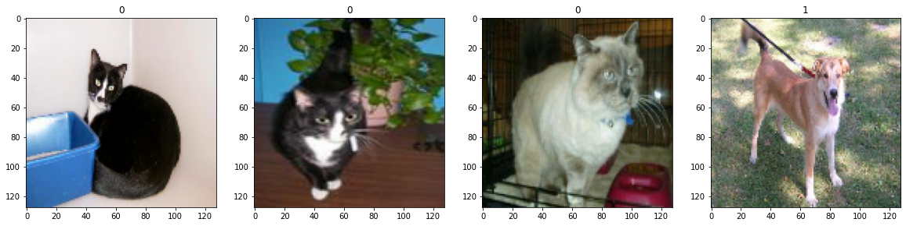

# Dogs and Cats Binary Classification with Deep Learning

A deep Convolutional neural network to classify photographs of cats and dogs.

The dogs vs cats dataset refers to a dataset used for a Kaggle machine learning competition held in 2013.
The dataset is comprised of photos of dogs and cats provided as a subset of photos from a much larger dataset of 3 million manually annotated photos. The dataset was developed as a partnership between Petfinder.com and Microsoft.

You can download it for free from [here](https://www.kaggle.com/c/dogs-vs-cats/data)
